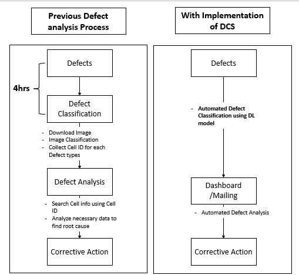
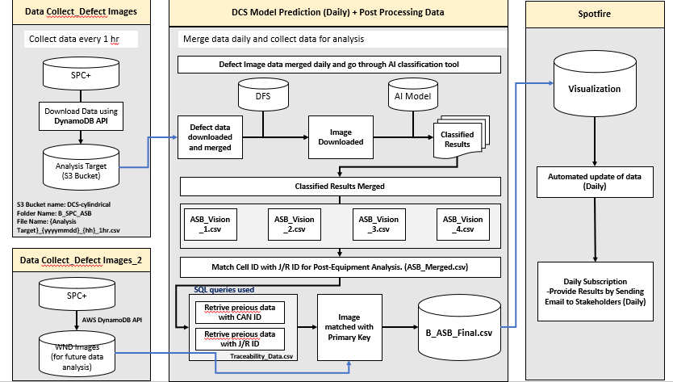
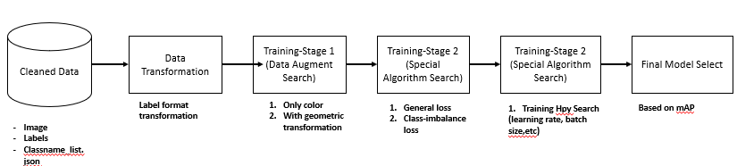

# AI-Based Defect Classification System (DCS)

## **Executive Summary**
Automated Defect Classification System with AI/ML-based screening tool using an iterative SDLC approach, incorporating stakeholder feedback, testing cycles, and model optimization. This tool identifies the root cause of defects, cutting defect analysis time by 60% and saving labor cost by USD 300K per production line.
### *Confidentiality Note:*
Due to company policy,source code, and dashboard designs are not disclosed. The following report presents a general overview of the project only.

---

## 1. Business Problem & Objective

In high-volume battery manufacturing, defect identification relies on binary OK/NG judgments from vision inspection systems without specific defect classification. Manual review of NG images and upstream sensor data was time-consuming and inconsistent.

**Business Objectives:**
- Automate defect type classification to reduce manual inspection time and resource use.
- Eliminate the need for repetitive image downloads, defect sorting, and root cause manual analysis.
- Improve accuracy and efficiency in identifying core-related defects such as TAB misalignment, Core length issues, and external pressure deformities.

**Pain Points Addressed:**
- Manual root cause analysis took approximately 4 hours per defect batch.
- Engineers manually checked SPC logs, image downloads, and defect types repeatedly.
- High labor resource cost and risk of inconsistent analysis.

**Success Metrics:**
- 60% reduction in defect analysis time
- $300K labor cost reduction per production line annually. 

## 2. Solution Architecture 

**Key Notes on System Behavior:**
- Data Colleciton Layer:  
  - Hourly data extraction from SPC+ using DynamoDB API (defect images from 4 vision sensors).
  - Data stored in S3 in structured folders with timestamped CSV files.
  - WND defect images also collected for future analysis.
- Model Prediction & Post-processing layer:
  - Daily batch process merges defect image data and performs classification with the prepared AI model.
  - Outputs classified results into four segmented CSV files (ASB_Vision_1.csv to ASB_Vision_4.csv), one file per vision sensor.
  - SQL queries retrieve traceability data:
      - Retrieve previous data using CAN ID or J/R ID for equipment traceability.
      - Use traceability data to link WND images and upstream process information.  
- Visualization Layer:
  - Spotfire dashboard automatically updates from B_ASB_Final.csv.  
  - Daily subscription sends updated insights via email to stakeholders.  
  - Fully automated workflow — no manual intervention required once the pipeline is live.  

## 3. Data Overview

**Data Tables& Files**
| Table/File Name        | Description                                        | Frequency | Volume Estimate            |
|-----------------------|----------------------------------------------------|-----------|---------------------------|
| B_SPC_ASB (S3 Bucket) | Raw defect image event logs from SPC+              | Hourly    | ~1,000 rows/hour          |
| ASB_Vision_1.csv      | Classified results for Vision Sensor 1             | Daily     | ~250 rows/day             |
| ASB_Vision_2.csv      | Classified results for Vision Sensor 2             | Daily     | ~250 rows/day             |
| ASB_Vision_3.csv      | Classified results for Vision Sensor 3             | Daily     | ~250 rows/day             |
| ASB_Vision_4.csv      | Classified results for Vision Sensor 4             | Daily     | ~250 rows/day             |
| B_ASB_Merged.csv      | Final merged defect classification result          | Daily     | ~1,000 rows/day           |
| WND Images            | Additional images for WND process                  | Daily     | ~3,000,000 images/day     |
| Traceability Data     | Contain Cell ID info with J/R ID                   | Daily     | ~3,000,000 rows/day       |
| Other Process Data    | Process data required for analysis                 | Daily     | ~3,000,000 rows/day       |
| B_ASB_Final.csv       | Final data with defects classified and matched process data | Daily | ~1,000 rows/day           |

**Description**
- SPC+ data is collected using AWS DynamoDB API and stored in structured hourly S3 buckets.
- ASB_Vision_1.csv to ASB_Vision_4.csv each correspond to separate vision sensors.
- B_ASB_Final.csv is used as the final dashboard input in Spotfire.
- WND image files are archived separately and only matched images are merged to analysis file.

## 4. Model Summary 

- **Model Type:** Supervised multi-class image classification (4 vision sensors, 20 defect types in total)
- Applied a CNN-based supervised image classification model, fine-tuned through an internal AutoML framework that covers augmentation, loss function tuning, and hyperparameter optimization, with mAP as the key performance metric.
- Further improvement plan by handling “Noisy Labels” labels that may have been recorded incorrectly during manual labeling

## 5. Results & Business Impact

| Metric                         | Pre-Implementation   | Post-Implementation                          |
|--------------------------------|---------------------|----------------------------------------------|
| Avg. Defect Analysis Time      | ~4 hours per batch   | <2.5 hours                                   |
| Labor Cost per Line            | High (manual)        | -$300K annually                              |
| Classification Accuracy        | Manual, inconsistent | ~95% avg mAP                                 |
| Process Data Matching Accuracy | Manual, inconsistent | Fully automated with traceability ID linkage |

### Key Achievements:
- Successfully deployed an AI-based Defect Classification System integrating equipment log data, defect images, and traceability information.
- Reduced manual labor requirements while improving accuracy and consistency of defect analysis.
- Fully automated pipeline from data collection to dashboard visualization, eliminating repetitive manual tasks.

### Further Development Plan:
- Expand model deployment from 4 vision sensors to full line coverage.
- Integrate noisy label handling mechanisms to improve long-term model reliability.
- Enhance dashboard features with predictive analytics for defect prevention.
